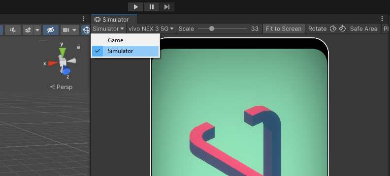

# Mobile Ludum In Spatio Isometric

## Table of contents

1) [About](#about)
2) [Getting Started](#starting)
3) [Usage](#useage)
4) [Building an apk](#building)

## About 

Our project aims to create a mobile game with underlaying story. The game will be mainly focused on the puzzles that create individual levels, which will be divided into several different environments; mainly abstract, nature, and architecture. The levels can be manipulated in almost any way imaginable, therefore the puzzles can be solved with the use of optical illusions, and hidden features that will create a way through the level that previously didn’t exist. The story will be told mainly through context clues from these puzzles, short cutscenes, and will be largely up to the player’s interpretation. Dialogue will be minimal.

## Getting started 

To run this project properly the right one version of Unity technologies Unity is needed. We have been using Unity version **2021.3.4f1**.
To be able to work properly with this project, Android module should be installed and attached to the installed Unity as well.

To open this project after downloading it, locate the root directory of this project using open project from disc in Unity hub app. Unity will downlad all packages and libraries automatically.

### **List of used packages**

|Name   |Author  |version|special requirements|
|-------|--------|-------|--------------------|
|- Mobile|(Unity Technologies)|2.0.1| iOS 10 and Android 4.4 or above|
|- Post Processing   |(Unity Technologies)|3.2.2| |
|- Test Framework    |(Unity Technologies)|1.1.31| |
|- TextMeshPro   |(Unity Technologies)|3.0.6|
|- Timeline  |(Unity Technologies)|1.6.4| |
|- Unity UI  |(Unity Technologies)|1.0.0| |
|- Universal RP  |(Unity Technologies)|12.1.7| |
|- Version Control   |(Unity Technologies)|1.17.1| |
|- Visual Scripting  |(Unity Technologies)|1.7.8| |
|- Visual Studio Code Editor |(Unity Technologies)|1.2.5| |

## Useage 

To be able to run and test this game in editor it is good to know this project was intended to work on devices equpped with touch screens. Standard Game window, where projects are usually running, does not count clicking as touches. The onTouch function is triggered but Unity does not in this mode provide further inforamtion about the touch. That leads to an error when trying to access that data.

The solution is to test this game in simulator mode in which clicking is handled correctly. To do so you have to select Simulator mode located in dropdown menu in top left corner of the game window (see picture below).

Projects in Unity can also be tested on connected Android devices via USB. For more informations see [Unity remote docs](https://docs.unity3d.com/Manual/UnityRemote5.html).

## Building an Android apk 

To build an apk installed Android module is needed. Then can be switched to Android platform in build settings\
 (File -> Build settings). For building apk file following dependences are required.

- The Android Build Support module (already mentioned)
- The Android Software Development Kit (SDK)
- The Native Development Kit (NDK)
- A Java Development Kit. By default, Unity uses OpenJDK

Description dealing with setting dependecies is part of the [official Unity Android environment setup docs](https://docs.unity3d.com/Manual/android-sdksetup.html).

Before building the apk file itself attention should be paid to the player settings which is mentioned in the [official Unity Player settings docs](https://docs.unity3d.com/Manual/class-PlayerSettingsAndroid.html).

Last but not least, you need to make sure that the Main scene is first on the list of scenes to ensure it will be played on startup.
